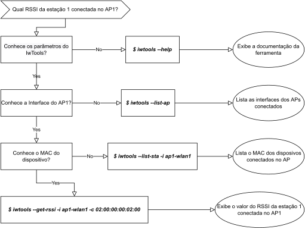

# IwTools

> :satellite: Ferramenta para monitoramento em tempo real dos dispositivos de rede sem fio

Com o uso da ferramenta, o administrador de redes poderá escolher quais informações irá coletar dos dispositivos de rede sem fio para resolver um problema espeficico, além de poder analiser o conjunto de dados e realizar auxiliar na tomada de decisão.

## :computer: Sobre a ferramenta

O Iwtools tem como objetivo auxilar o administrador de rede no monitoramento remoto em tempo real dos dispositvos de rede sem fio, por meio de um terminal CLI ou com scripts Python, itegrando com outras ferramentas de monitoramento como Prometheus e OpenConfig.

## Preparação
Instalação das dependências
```bash
$ sudo apt-get install python3-setuptools 
```

## :rocket: Get Started

Faça o clone do repositório e instale a ferramenta com os seguintes comandos:

```bash
$ git clone https://github.com/wvdomingos/IwTools.git
$ cd IwTools
$ sudo make install
```

Para conferir a instalação, digite os comandos:
```bash
$ cd ~
$ iwtools --version
```

### 🤔 Como usar?

Para demonstrar o uso do IwTools, vamos emular um ambiente virtual de rede sem fio com a ferramenta [Mininet-WiFi](https://github.com/intrig-unicamp/mininet-wifi), onde temos um Acess Point e três estações conectas via WiFi.

Primeiro listar as interfaces dos APs:
```bash
$ iwtools --list-ap
AP
ap1-wlan1
```

Depois precisamos listar o MAC das estações conectadas:
```bash
$ iwtools --list-sta -i ap1-wlan1
AP	MAC
ap1-wlan1	02:00:00:00:00:00
ap1-wlan1	02:00:00:00:01:00
ap1-wlan1	02:00:00:00:02:00
```

Por fim, executar o comando para saber o RSSI da estação selecionada:
```bash
$ iwtools --get-rssi -i ap1-wlan1 -c 02:00:00:00:02:00
AP	MAC	RSSI
ap1-wlan1	02:00:00:00:00:00	-36
```

A seguir temos um fluxo demonstrando esse exemplo.

<center>
    
</center>

### :book: Help
Comando para listar a documentação da ferramenta:

```bash
$ iwtools --help
```


## :page_facing_up: Lista de Comandos
### Informações dos *Access Point*

| Comando | Argumento 1 | Objetivo |
| --- | --- | --- |
| `--list-ap`        |           | Lista os Access Points |
| `--get-ap-mac`     | `-i <AP>` | Lista os MAC dos Access Points |
| `--get-ap-ssid`    | `-i <AP>` | Lista os SSID |
| `--get-ap-channel` | `-i <AP>` | Lista os Channels |
| `--get-ap-freq`    | `-i <AP>` | Lista as Frequencias |
| `--get-ap-txpower` | `-i <AP>` | Lista os TX Power |
| `--get-ap-json`    | `-i <AP>` | Gerar arquivo Json sobre AP |


### Informações das estações

| Comando | Argumento 1 | Argumento 2 | Objetivo |
| --- | --- | --- | --- |
| `--list-sta`       | `-i <AP>` |            | Lista os MAC das Stations |
| `--get-inactive`   | `-i <AP>` | `-c <MAC>` | Lista o tempo inativo |
| `--get-rxbytes`    | `-i <AP>` | `-c <MAC>` | Lista o RX bytes |
| `--get-rxpackets`  | `-i <AP>` | `-c <MAC>` | Lista o RX Packets |
| `--get-txbytes`    | `-i <AP>` | `-c <MAC>` | Lista o TX bytes |
| `--get-txpackets`  | `-i <AP>` | `-c <MAC>` | Lista o TX Packets |
| `--get-txretries`  | `-i <AP>` | `-c <MAC>` | Lista o TX Retries |
| `--get-txfailed`   | `-i <AP>` | `-c <MAC>` | Lista o TX Failed |
| `--get-rxdrop`     | `-i <AP>` | `-c <MAC>` | Lista o RX Drop |
| `--get-rssi`       | `-i <AP>` | `-c <MAC>` | Lista o RSSI |
| `--get-rssi-avg`   | `-i <AP>` | `-c <MAC>` | Lista o RSSI-AVG |
| `--get-txduration` | `-i <AP>` | `-c <MAC>` | Lista o TX duration |
| `--get-dtim`       | `-i <AP>` | `-c <MAC>` | Lista o DTIM |
| `--get-beacon`     | `-i <AP>` | `-c <MAC>` | Lista o Beacon |
| `--get-connected`  | `-i <AP>` | `-c <MAC>` | Lista o Timestamp conectado |
| `--get-boottime`   | `-i <AP>` | `-c <MAC>` | Lista o tempo inicio da conexão |
| `--get-associated` | `-i <AP>` | `-c <MAC>` | Lista o Timestamp associado |
| `--get-current`    | `-i <AP>` | `-c <MAC>` | Lista o Timestamp autal |
| `--get-sta-json`   | `-i <AP>` | `-c <MAC>` | Gera arquivo Json sobre Station |


## 🎞️ Demo
[Click aqui!]() para assistir a demonstração da ferramenta.